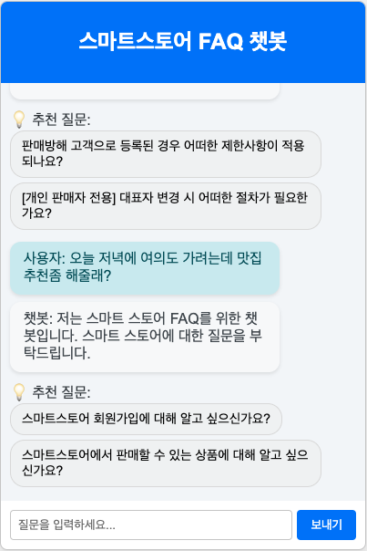

# API 상세 문서: Smartstore FAQ Chatbot

🚨 **주의 사항: 반드시 Codespaces에서 실행해주세요!**  

로컬 환경에서의 의존성 설치 이슈로 인해 **Codespaces에서 개발 및 구현을 진행**한 점 양해 부탁드립니다.  

🛠 **Codespaces에서 실행하는 방법**  

1. **저장소 페이지로 이동**  
2. **`<> Code` 버튼 클릭**  
3. **Codespaces 탭에서 `Create codespace on main` 클릭**  
4. **Codespaces에서 자동으로 환경이 설정될 때까지 기다리기**  
5. **터미널에서 필요한 의존성 설치 후 실행**  
   - **2.3. 필요한 패키지 설치 단계부터 진행해주시면 됩니다.**
---

이 문서는 FastAPI를 사용하여 구현된 스마트스토어 FAQ 챗봇 API의 상세 내용을 설명합니다. 이 문서는 엔드포인트, 설정, 초기화 및 동작 방식을 포함합니다.

## 1. 기본 정보

- **API 이름:** Smartstore FAQ Chatbot API
- **프레임워크:** FastAPI
- **주요 기능:**
  - 스마트스토어 관련 질문에 대한 FAQ 기반 응답 제공
  - 관련 없는 질문에 대한 안내 메시지와 후속 질문 제안
  - HTTP 스트리밍을 통한 실시간 응답 제공

## 2. 설정 및 실행

### 1. 이 레포지토리를 클론합니다:

```bash
git clone https://github.com/Parkseokje/smartstore-rag-chatbot.git
cd smartstore-rag-chatbot
```

### 2. pyenv를 사용하여 Python 3.12 설치:

```bash
pyenv install 3.12.8
pyenv virtualenv 3.12.8 rag
pyenv activate rag
python -V
```

#### 3. 필요한 패키지를 설치합니다:

```bash
python -m pip install --upgrade pip
pip install --upgrade pip setuptools wheel
pip install -r requirements.txt
```

#### 4. 환경 변수

`.env` 파일에 다음과 같은 환경 변수를 설정해야 합니다.

예시:

```text
CHROMA_PERSIST_DIRECTORY=./chroma_data
EMBEDDING_MODEL=sentence-transformers/paraphrase-multilingual-MiniLM-L12-v2
OPENAI_API_KEY={open_api_key}
LLM_MODEL=gpt-4o-mini
COLLECTION_NAME=smartstore_faq
```

| 변수명                     | 설명                                   |
| -------------------------- | -------------------------------------- |
| `CHROMA_PERSIST_DIRECTORY` | ChromaDB 데이터 저장 디렉토리 경로     |
| `EMBEDDING_MODEL`          | 임베딩에 사용할 모델 이름              |
| `OPENAI_API_KEY`           | OpenAI API 키                          |
| `LLM_MODEL`                | 사용할 LLM 모델 이름                   |
| `COLLECTION_NAME`          | 컬렉션 이름                   |    

### 5. faq 데이터를 임베딩 하여 ChromaDB에 적재합니다:

```bash
python VectorPreparation.py
```

### 6. 실행

```bash
uvicorn main:app --host 0.0.0.0 --port 8080
```

### 7. 브라우저로 이동

```bash
Uvicorn running on http://0.0.0.0:8080 (Press CTRL+C to quit)
```

## 3. FastAPI 애플리케이션(main.py)

### 3.1. 애플리케이션 초기화

FastAPI 애플리케이션의 `lifespan` 컨텍스트 관리자를 사용하여 시작 및 종료 시 서비스를 초기화합니다.

```python
@asynccontextmanager
async def lifespan(app: FastAPI):
"""애플리케이션 시작 및 종료 이벤트 핸들러"""
logger.info("애플리케이션 시작 중...")

if not hasattr(app.state, "initialized"):
    initialize_services(app)
    app.state.initialized = True

yield

logger.info("애플리케이션 종료 중...")
```

애플리케이션 상태에 `LLMService` 및 `ChromaDBService` 인스턴스를 생성하고 저장합니다. 중복 초기화를 방지합니다.

```python
def initialize_services(app: FastAPI):
  """서비스 초기화"""
  if hasattr(app.state, "llm_service") and hasattr(app.state, "chroma_service"):
  logger.info("서비스가 이미 초기화되었습니다.")
  return

logger.info("서비스 초기화 시작...")
app.state.llm_service = LLMService(api_key=OPENAI_API_KEY, llm_model=LLM_MODEL)
app.state.chroma_service = ChromaDBService(
    persist_directory=CHROMA_PERSIST_DIRECTORY,
    embedding_model=EMBEDDING_MODEL,
)
logger.info("서비스 초기화 완료.")
```

### 3.2. 미들웨어 설정

CORS (Cross-Origin Resource Sharing) 미들웨어를 설정하여 모든 오리진, 자격 증명, 메서드 및 헤더를 허용합니다.

```python
app.add_middleware(
  CORSMiddleware,
    allow_origins=[""],
    allow_credentials=True,
    allow_methods=[""],
    allow_headers=["*"],
)
```

### 3.3. 템플릿 및 정적 파일 설정

Jinja2 템플릿 엔진과 정적 파일 디렉토리를 설정합니다.

```python
app.mount("/static", StaticFiles(directory="static"), name="static")
templates = Jinja2Templates(directory="templates")
```

### 3.4. 엔드포인트

#### 3.4.1. GET `/`

HTML 템플릿을 렌더링하여 기본 챗봇 인터페이스를 제공합니다.

**요청**

- **Method:** `GET`
- **Response Class:** `HTMLResponse`

**응답**

HTML 페이지가 반환되며, 초기 메시지로 다음과 같은 안내 메시지가 포함됩니다.

```text
안녕하세요! 스마트스토어 FAQ 챗봇입니다. 무엇을 도와드릴까요?
```

#### 3.4.2. GET `/stream-chat`

사용자 메시지를 처리하고, 관련 FAQ를 검색하여 실시간 스트리밍 방식으로 응답을 제공합니다.

**요청**

- **Method:** `GET`
- **Query Parameters:**
  - `message` (필수): 사용자 입력 메시지 (예: "스마트스토어 회원가입 방법은?")
  - `session_id` (선택): 기존 세션 ID (미입력 시 새로운 세션 ID 생성)

**응답**

- **Response Class:** `StreamingResponse`
- **Media Type:** `text/event-stream`

스트리밍 방식으로 응답 데이터를 전송합니다.

### 3.5. 동작 흐름

1. 세션 ID를 확인하고, 없으면 새로 생성합니다.
2. 사용자 메시지를 대화 기록에 추가합니다.
3. 메시지가 스마트스토어 관련인지 확인합니다.
   - 관련 없는 경우: 안내 메시지와 후속 질문을 스트리밍합니다.
   - 관련 있는 경우: ChromaDB에서 FAQ 검색 -> LLM을 통해 답변 생성 -> 스트리밍합니다.
4. 최종적으로 후속 질문 리스트를 포함한 응답을 반환합니다.

### 3.6. 스트리밍 데이터 예시

```json
data: {"session_id": "123e4567-e89b-12d3-a456-426614174000", "answer": "스마트스토어 회원가입은 네이버 계정으로 가능합니다.", "done": false}

data: {"session_id": "123e4567-e89b-12d3-a456-426614174000", "follow_up_questions": ["회원가입 절차에 대해 더 알고 싶으신가요?", "스마트스토어 이용 요금에 대해 알고 싶으신가요?"], "done": true}
```

### 3.7. 모델 설명

### 3.7.1. ChatMessage

사용자 또는 챗봇의 개별 메시지를 나타냅니다.

| 필드명  | 타입  | 설명                                 |
| ----- | ----- | ------------------------------------ |
| `role`  | `str` | 메시지의 주체 (`user` 또는 `assistant`) |
| `content` | `str` | 메시지 내용                           |

### 3.7.2. ChatRequest

챗봇 요청 데이터를 나타냅니다.

| 필드명       | 타입         | 설명                                  |
| ------------ | ------------ | ------------------------------------- |
| `session_id` | `Optional[str]` | 세션 ID (없으면 새로 생성)             |
| `message`    | `str`        | 사용자 입력 메시지                      |

### 3.7.3. ChatResponse

챗봇 응답 데이터를 나타냅니다.

| 필드명               | 타입        | 설명                                      |
| -------------------- | ----------- | ----------------------------------------- |
| `session_id`         | `str`       | 세션 ID                                   |
| `answer`             | `str`       | 챗봇의 응답                               |
| `follow_up_questions` | `List[str]` | 추천 후속 질문 리스트                        |
| `done`               | `bool`      | 응답 완료 여부                             |

## 3.8. 세션 관리 및 주요 로직

### 3.8.1. 세션 관리

1. 세션 ID는 요청 시 전달되지 않으면 새로 생성됩니다.
2. 각 세션은 대화 기록(`conversation_history`)을 유지하며, 이는 메모리에 저장됩니다.
3. 대화 기록 초기화 시 기본 시스템 메시지가 포함됩니다.

```text
당신은 네이버 스마트스토어 FAQ를 담당하는 챗봇입니다. FAQ 내용을 기반으로 정확하고 도움이 되는 답변을 제공해주세요.
```

### 3.8.2. FAQ 검색 및 응답 생성

1. 사용자 입력 메시지는 ChromaDB를 통해 임베딩 벡터와 비교하여 관련 FAQ를 검색합니다.
2. 검색된 FAQ는 LLM(OpenAI GPT)을 활용해 답변 생성을 위한 컨텍스트로 사용됩니다.
3. 결과는 스트리밍 방식으로 사용자에게 전달됩니다.

### 3.8.3. 스마트스토어 관련성 확인

LLMService의 메서드를 통해 사용자의 입력이 스마트스토어와 관련 있는지 판단합니다.

- 관련 없는 경우, 안내 메시지와 추천 질문이 반환됩니다.

### 3.8.4. 예외 처리

1. ChromaDB 검색 중 오류 발생 시 빈 리스트 반환 및 로깅
2. LLM 응답 생성 중 오류 발생 시 기본 안내 메시지 반환

## 4. 기타 클래스 설명

### 4.1. LLMService.py

이 모듈은 OpenAI의 API를 활용하여 자연어 처리 서비스를 제공하는 **LLMService** 클래스입니다. 주요 기능은 FAQ 기반 답변 생성, 질문 관련성 확인, 후속 질문 생성, 그리고 동기 및 비동기 방식으로 답변을 생성하는 것입니다. 아래는 코드의 주요 구성 요소와 기능에 대한 설명입니다:

---

#### 1. **클래스 초기화**
```python
def __init__(self, api_key: str, llm_model: str):
```
- **목적**: OpenAI API와 모델을 초기화합니다.
- `api_key`: OpenAI API 인증 키.
- `llm_model`: 사용할 LLM 모델 이름(e.g., `gpt-3.5-turbo`).
- 동기 클라이언트(`sync_client`)와 비동기 클라이언트(`async_client`)를 각각 설정하여 다양한 API 호출 방식 지원.

---

### 2. **프롬프트 생성**
```python
def create_answer_prompt(self, user_message: str, faq_context: str) -> str:
```
- **목적**: 사용자 메시지와 FAQ 컨텍스트를 기반으로 답변 프롬프트를 생성합니다.
- FAQ 정보만 사용하여 답변하도록 규칙을 명시하며, 간결하고 친절한 톤을 유지하도록 요청합니다.

---

### 3. **스마트스토어 관련성 확인**
```python
def is_smartstore_related(self, query: str) -> bool:
```
- **목적**: 질문이 네이버 스마트스토어와 관련 있는지 확인합니다.
- OpenAI Chat Completion API를 사용하여 "True" 또는 "False" 응답을 반환합니다.
- 실패 시 기본적으로 `True`를 반환하여 안정성을 유지합니다.

---

### 4. **후속 질문 생성**
```python
def generate_follow_up_questions(self, context: str, conversation: List[Dict[str, str]]) -> List[str]:
```
- **목적**: 대화 맥락과 FAQ 정보를 기반으로 사용자가 다음에 물어볼 만한 질문을 생성합니다.
- 최대 2개의 후속 질문을 반환하며, 실패 시 기본 질문을 제공합니다.

---

### 5. **답변 생성 (동기 방식)**
```python
def generate_answer(self, conversation_history: List[Dict[str, str]], prompt: str) -> str:
```
- **목적**: OpenAI API를 사용해 동기적으로 답변을 생성합니다.
- 대화 히스토리와 사용자 프롬프트를 기반으로 응답을 생성하며 최대 500 토큰까지 반환합니다.
- 오류 발생 시 기본 오류 메시지를 반환합니다.

---

### 6. **답변 생성 (비동기 스트리밍 방식)**
```python
async def generate_streaming_answer(self, conversation_history: List[Dict[str, str]], prompt: str) -> AsyncGenerator[str, None]:
```
- **목적**: 비동기 스트리밍 방식으로 답변을 생성하여 실시간 응답 제공합니다.
- OpenAI의 스트리밍 API를 사용하며 각 응답 조각(chunk)을 순차적으로 반환합니다.
- 오류 발생 시 기본 오류 메시지를 스트림으로 반환합니다.

---

### 핵심 기능 요약

| 기능                           | 설명                                                                 |
|--------------------------------|----------------------------------------------------------------------|
| OpenAI API 초기화               | 동기 및 비동기 클라이언트를 설정하여 다양한 호출 방식 지원.          |
| 프롬프트 생성                  | 사용자 메시지와 FAQ 정보를 기반으로 답변 요청 텍스트 생성.           |
| 스마트스토어 관련성 확인        | 질문이 스마트스토어 관련 여부를 판단하여 "True"/"False" 반환.       |
| 후속 질문 생성                 | 대화 맥락에서 추가로 물어볼 만한 질문 2개를 자동 생성.              |
| 동기적 답변 생성               | 대화 히스토리를 기반으로 GPT 모델을 활용해 응답 텍스트 반환.        |
| 비동기 스트리밍 답변 생성       | 실시간 스트리밍 방식으로 GPT 모델의 응답 조각 순차 반환.            |

### 4.2. VectorPreparation.py

### 클래스 설명: `VectorPreparation`

이 코드는 벡터 데이터베이스인 **ChromaDB**를 활용하여 텍스트 데이터를 임베딩하고 저장하는 과정을 자동화하는 Python 클래스입니다. 주요 기능은 데이터를 로드하고, 임베딩을 생성한 뒤, 이를 ChromaDB 컬렉션에 저장하며, 저장된 데이터를 검증하는 것입니다. 아래는 클래스의 주요 구성 요소와 각 메서드에 대한 설명입니다.

---

#### **1. 클래스 개요**
| 필드명                  | 타입        | 설명                                                                 |
|-------------------------|------------|----------------------------------------------------------------------|
| `data_path`             | 문자열      | 데이터 파일 경로 (예: `final_result.pkl`).                            |
| `logger`                | 로거 객체    | 로깅을 위한 Python `logging` 모듈 객체.                               |
| `embedding_model`       | 객체        | SentenceTransformer 임베딩 모델 객체.                                |
| `chroma_client`         | 객체        | ChromaDB 클라이언트 (PersistentClient).                              |
| `collection`            | 객체        | ChromaDB 컬렉션 (데이터 저장 공간).                                   |

---

#### **2. 주요 메서드**

| 메서드명                  | 반환 타입    | 설명                                                                 |
|---------------------------|------------|----------------------------------------------------------------------|
| **`__init__`**            | 없음         | 클래스 초기화, 디렉토리 재설정, 임베딩 모델 및 ChromaDB 클라이언트 초기화. |
| **`_reset_directory`**    | 없음         | 기존 디렉토리를 삭제하고 새로 생성.                                   |
| **`load_data`**           | 불리언       | 데이터를 파일에서 로드하고 적절히 검증 및 변환.                        |
| **`_validate_and_format_data`** | 리스트      | 데이터 형식을 검증하고 필요한 경우 변환.                               |
| **`embed_in_batches`**    | 불리언       | 데이터를 배치 단위로 임베딩하고 ChromaDB 컬렉션에 저장.                 |
| **`verify_collection`**   | 불리언       | 저장된 컬렉션의 데이터 수와 쿼리 테스트를 통해 검증.                    |
| **`run`**                 | 불리언       | 전체 프로세스 실행 (데이터 로드 → 임베딩 → 저장 → 검증).                |

---

#### **3. 메서드 상세 설명**

##### **`__init__`: 클래스 초기화**
- 데이터 경로를 받아 초기화하며, 기존 디렉토리를 재설정합니다.
- SentenceTransformer를 사용해 임베딩 모델을 초기화하며, ChromaDB 클라이언트를 생성합니다.

##### **`_reset_directory`: 디렉토리 재설정**
- 기존 디렉토리가 존재하면 삭제(`shutil.rmtree`) 후 새로 생성합니다.
- 이 과정은 이전 데이터가 중복되지 않도록 보장합니다.

##### **`load_data`: 데이터 로드**
- 지정된 파일(`data_path`)에서 데이터를 로드합니다.
- 데이터가 딕셔너리 또는 리스트 형식인지 확인하며, 올바르지 않을 경우 예외를 발생시킵니다.

##### **`embed_in_batches`: 배치 단위 임베딩**
- 데이터를 배치 크기(`BATCH_SIZE`)만큼 나누어 처리합니다.
- 각 배치에서 질문 데이터를 SentenceTransformer로 임베딩한 뒤, ChromaDB 컬렉션에 추가합니다.
- 각 항목에는 고유 ID와 메타데이터(답변 및 타임스탬프)가 포함됩니다.

##### **`verify_collection`: 컬렉션 검증**
- ChromaDB 컬렉션의 항목 수를 확인하고, 샘플 질문으로 쿼리를 테스트합니다.
- 쿼리 결과가 반환되면 성공으로 간주합니다.

##### **`run`: 전체 프로세스 실행**
- 데이터 로드 → 임베딩 생성 → 저장 → 검증의 전체 프로세스를 실행합니다.
- 성공 여부와 소요 시간을 로깅합니다.

---

#### **4. 활용 예시**

```python
if __name__ == "__main__":
    processor = VectorPreparation("final_result.pkl")
    if processor.run():
        print("데이터 임베딩 및 저장 완료.")
    else:
        print("데이터 임베딩 및 저장 과정에서 오류가 발생했습니다.")
```
- 위 코드는 `final_result.pkl` 파일을 처리하여 벡터 데이터를 ChromaDB에 저장하고 검증하는 전체 프로세스를 실행합니다.

### 7.3. ChromaDBService.py

### 클래스 설명: `ChromaDBService`

`ChromaDBService` 클래스는 **ChromaDB**를 활용하여 벡터 데이터베이스 작업(임베딩 생성, 컬렉션 로드, 유사도 검색 등)을 처리하는 기능을 제공합니다. 이 클래스는 임베딩 모델과 ChromaDB 클라이언트를 초기화하고, 사용자 질문과 관련된 FAQ를 검색하는 기능을 포함합니다.

---

#### **1. 클래스 개요**

| 필드명                  | 타입        | 설명                                                                 |
|-------------------------|------------|----------------------------------------------------------------------|
| `persist_directory`     | 문자열      | ChromaDB 데이터를 저장할 디렉토리 경로.                                |
| `embedding_model`       | 문자열      | SentenceTransformer 임베딩 모델 이름.                                 |
| `embedding_function`    | 객체        | ChromaDB에서 사용할 임베딩 함수.                                      |
| `client`                | 객체        | ChromaDB PersistentClient 객체.                                      |
| `vector_collection`     | 객체        | ChromaDB 컬렉션 객체 (벡터 데이터 저장소).                             |

---

#### **2. 주요 메서드**

| 메서드명                       | 반환 타입    | 설명                                                                 |
|--------------------------------|------------|----------------------------------------------------------------------|
| **`__init__`**                 | 없음         | 클래스 초기화, 임베딩 함수 및 ChromaDB 클라이언트 초기화, 컬렉션 로드.  |
| **`_initialize_embedding_function`** | 객체        | SentenceTransformer 기반 임베딩 함수 초기화.                          |
| **`_initialize_chroma_client`**| 객체        | ChromaDB PersistentClient 초기화.                                    |
| **`_load_vector_collection`**  | 객체        | 지정된 이름의 벡터 컬렉션 로드 또는 생성.                              |
| **`get_related_faq`**          | 리스트       | 사용자 질문과 유사한 FAQ 문서를 검색하고 상위 결과 반환.                |

---

#### **3. 메서드 상세 설명**

##### **`__init__`: 클래스 초기화**
- **기능**:
  - 로거 초기화.
  - 임베딩 함수와 ChromaDB 클라이언트를 초기화.
  - 지정된 이름의 벡터 컬렉션(`smartstore_faq`)을 로드.
- **예외 처리**:
  - 임베딩 함수 또는 클라이언트 초기화 실패 시 예외 발생.

##### **`_initialize_embedding_function`: 임베딩 함수 초기화**
- **기능**:
  - SentenceTransformer 모델을 기반으로 임베딩 함수를 생성.
  - CPU 장치를 기본으로 사용.
- **예외 처리**:
  - 임베딩 함수 생성 실패 시 예외 발생.

##### **`_initialize_chroma_client`: ChromaDB 클라이언트 초기화**
- **기능**:
  - PersistentClient를 통해 ChromaDB 클라이언트를 생성.
- **예외 처리**:
  - 클라이언트 생성 실패 시 예외 발생.

##### **`_load_vector_collection`: 벡터 컬렉션 로드**
- **기능**:
  - 지정된 이름의 벡터 컬렉션을 로드.
  - 컬렉션이 존재하지 않을 경우 예외 발생.
- **예외 처리**:
  - 컬렉션 로드 실패 시 오류 메시지와 함께 예외 발생.

##### **`get_related_faq`: 관련 FAQ 검색**
- **기능**:
  - 사용자 질문을 기반으로 상위 `top_k`개의 관련 FAQ를 검색.
  - 결과는 질문, 답변, 유사도 점수를 포함한 딕셔너리 리스트로 반환.
- **결과 형식**:
```python
[
    {"question": "질문1", "answer": "답변1", "score": 0.85},
    {"question": "질문2", "answer": "답변2", "score": 0.78},
]
```
- **예외 처리**:
  - KeyError 또는 기타 오류 발생 시 빈 리스트 반환.

---

#### **4. 활용 예시**

```python
if __name__ == "__main__":
    # ChromaDBService 인스턴스 생성
    chroma_service = ChromaDBService(
        persist_directory="./chroma_data",
        embedding_model="all-MiniLM-L6-v2"
    )

    # 사용자 질문에 대한 관련 FAQ 검색
    query = "스마트스토어에서 상품 등록 방법은?"
    related_faqs = chroma_service.get_related_faq(query)

    # 결과 출력
    if related_faqs:
        for faq in related_faqs:
            print(f"질문: {faq['question']}\n답변: {faq['answer']}\n유사도 점수: {faq['score']}\n")
    else:
        print("관련 FAQ를 찾을 수 없습니다.")
```

---

#### **5. 주요 특징 및 장점**
1. **SentenceTransformer 통합**: 다양한 텍스트 임베딩 모델 지원.
2. **ChromaDB 활용**: SQLite 기반의 빠르고 효율적인 벡터 데이터 저장 및 검색 가능.
3. **유연한 설계**: 다른 임베딩 모델 및 컬렉션 이름으로 쉽게 확장 가능.
4. **FAQ 검색 기능 제공**: 사용자 질문에 대한 관련 정보를 빠르게 검색 가능.

## 8. 주요 화면

